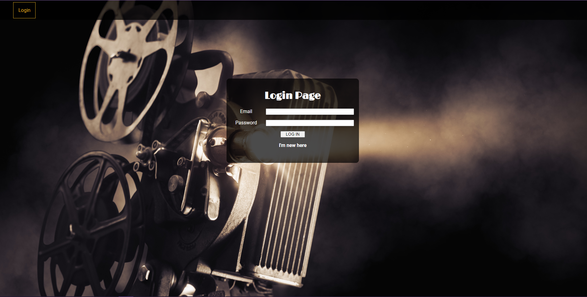
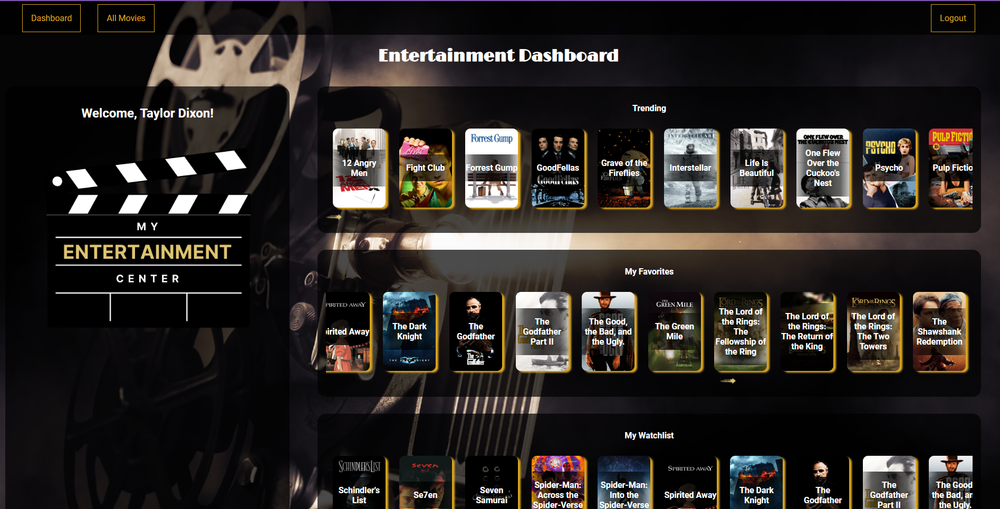
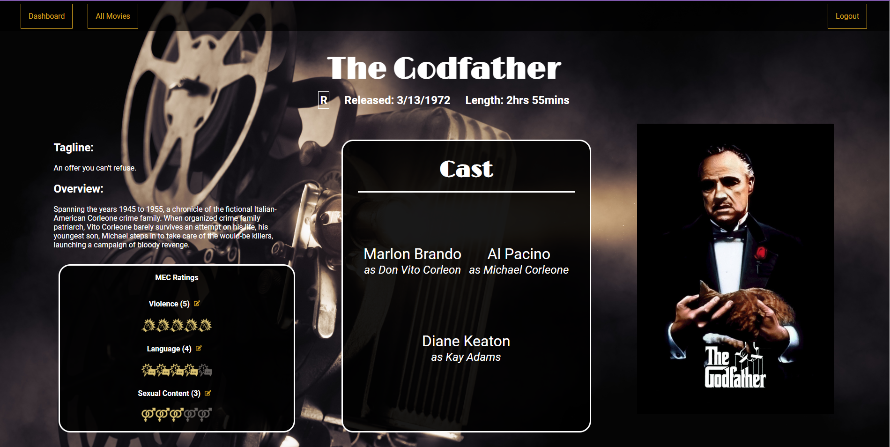

# My Entertainment Center
My Entertainment Center is a movie database that allows users to give advisory ratings on a more granular level, breaking down the normal MPAA rating system into categories such as violence, language, and sexual content. We hope to offer users a more tailored movie viewing experience!

## Screenshots
  
  

## Technology Used
MERN Stack
 
The Movie Database API (https://developer.themoviedb.org)

## Getting Started
[Launch the game](https://my-entertainment-center-e89b41a797a6.herokuapp.com/)
 
[Trello Board](https://trello.com/b/zooWMOLc/my-entertainment-center-main)

### Next Steps
* Connect all movies from TMDB API to increase our database
* Add more advisories
* Show aggregate advisories scores for all users
* Add TV shows
* Add "Favorites" and "Owned" features
* Create a "My Entertainment Center" page that holds user watchlist, favorites, owned, and settings
